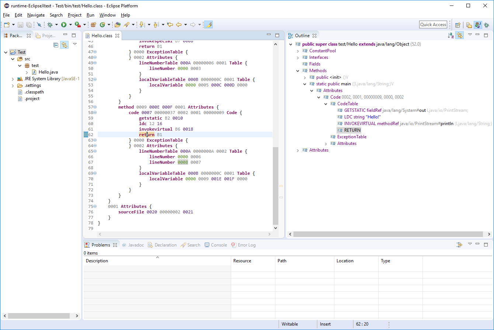
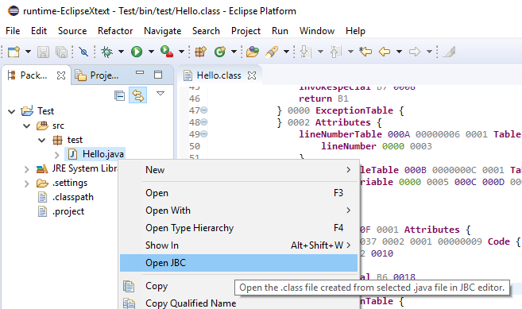
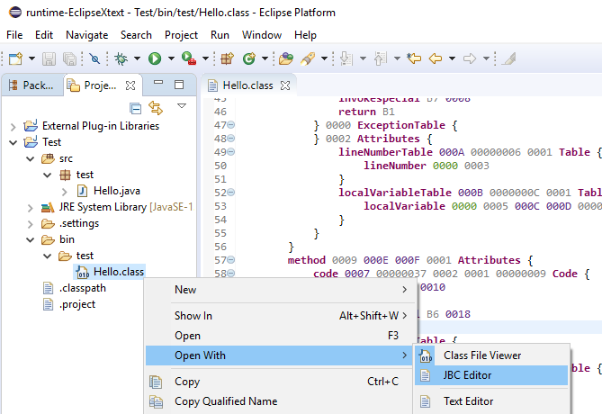

# JBC

JBC is an eclipse plugin that enables the developer to view and edit files containing java byte code (*.class) inside eclipse.
This is done in a way such that a specialized editor opens the .class file and displays the binary code as a textual DSL whereas keywords intersparse the byte sequences.
Changing the text and saving then writes back the bytes to the .class file.

To support the developer the outline displays and interpretation of the byte code with resolved references.
There is validation and quick fixes for table sizes as well as quick navigation (F3) to referenced elements, autocompletion, hover information and some more.

One can open the .class file for a java file from the Project or Package Explorer by executing the context menu action "Open JBC". The opened class file can be viewed and editor. But of course, if you modify your java file, the class file will be overridden. This is mostly intended to help you understand what your source code is transformed to by the compiler.

It is also possible to open a .class file directly from the Project or Package Explorer by opening it with the "JBC Editor". It is not necessary that the class file is inside a java project, it just needs to be in the workspace. You can, for example, extract some jar, modify the included .class files and write them back to the jar. This way you can modify existing jars without having the source available.

